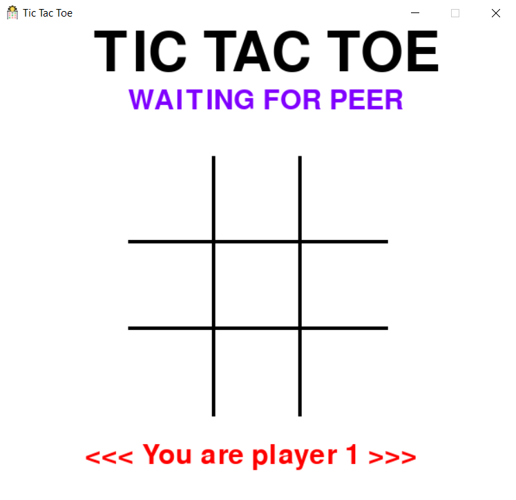
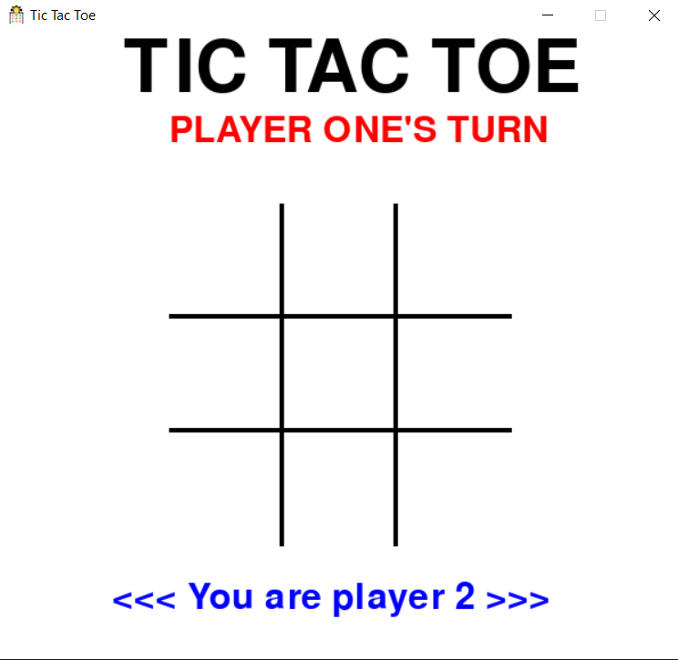

# Tic-Tac-Toe

This repository contains the source code for a Dockerized Tic-Tac-Toe application. It includes Docker configurations for the server, client, and a terminal-based client interface. The project is structured to facilitate easy building, scanning for vulnerabilities, and pushing of Docker images using GitHub Actions.


## How to Play?

- Clone the Repository

```bash
git clone https://github.com/vladi2703/Tic-Tac-Toe.git
```

- On linux machine:

```bash
xhost +local:docker
docker compose up -d
```

- To stop:

```bash
docker compose down
```

---

## Screenshots

|            Player 1             |            Player 2             |
| :-----------------------------: | :-----------------------------: |
|  |  |

---

## Structure

- `server/`: Contains the Dockerfile and source code for the server component of the Tic-Tac-Toe game.
- `client/`: Contains the Dockerfile and source code for the client component.
- `client-terminal/`: Houses the Dockerfile and source code for a terminal-based client interface.
- `sql/`: Housed the SQL migrations for the players database.

Each component is containerized and managed independently.

## Docker

The `docker-compose.yml` file defines a multi-container Docker application for a Tic-Tac-Toe game. The application consists of three services: `server`, `player1`, and `player2`.

1. **Server Service**: This service builds the Docker image for the server from the Dockerfile located in the `./server` directory. 

2. **Players 1/2 Service**: These services build the Docker image for the players' client from the Dockerfile located in the `./client` directory. It uses the host's display settings for the client's display. It also mounts the host's X11 Unix socket to the container's X11 Unix socket, allowing the client to display a GUI on the host's display. The container is named `tic-tac-toe-player1/2` and uses the host's network stack for networking.

In summary, this Docker setup allows you to run a Tic-Tac-Toe game with two players on the same host machine. The server and each client run in their own Docker containers, and the clients display their GUIs on the host's display.

A GitHub Actions pipeline, named "Docker Build, Scan and Publish", is triggered on every push or pull request to the `master` branch. 

## CI/CD

**Using GitHub Actions for CI/CD**:

- The repository is configured with GitHub Actions for continuous integration and deployment.
- On every push to the master branch, Docker images are built, scanned for vulnerabilities, and pushed to Docker Hub.

### Security measures

Multiple security scans are being run on merge request and each time the `master` branch is updated.

#### Snyk-Security Job

 This job performs a security scan on the Snyk, a tool that finds and fixes vulnerabilities in dependencies. It installs Snyk, authenticates with a token, and then runs a test to find critical severity issues, excluding Docker-related files. Snyk security runs are also being run using the web application. 

#### Gitleaks Job 

This job checks for secrets leakage in the repository using Gitleaks, a tool that detects hardcoded secrets like passwords, API keys, and tokens in git repositories. It fetches the entire git history for thorough scanning.

#### SonarCloud

There's also a commented-out job for SonarCloud, a cloud-based code quality and security service. Currently the web application SonarCloud executes scans. If enabled, it would scan the codebase for code smells, bugs, and security vulnerabilities **as part of the pipeline**.

#### [Docker image security](#docker-build-scan-publish-composite-action) 

### Docker


A pipeline consists of four jobs: `setup`, `server-image`, `client-image`, and `client-terminal-image`. Although it may seem like code duplication, this structure allows for faster execution of more complex build operations. The images are independent of each other and can be built in parallel.


1. **Server Image Job**: It checks out the code, logs in to Docker Hub using the `DOCKERHUB_USERNAME` and `DOCKERHUB_TOKEN` secrets, and then builds, scans, and pushes the server image using the `vladi2703/docker-build-scan-publish@main` action.

- Other jobs do the same for the other containers

In summary, this pipeline automates the process of building, scanning, and publishing Docker images for the server, client, and client terminal parts of the application.

### [docker-build-scan-publish](https://github.com/vladi2703/docker-build-scan-publish) composite action

This action builds a Docker image from a specified Dockerfile, scans it for vulnerabilities using Trivy, and then pushes the image to Docker Hub.

The action has five required inputs:

1. `dockerfile`: The path to the Dockerfile used to build the image.
2. `image-name`: The name of the Docker image.
3. `dockerhub-username`: The DockerHub username used to push the image.
4. `dockerhub-token`: The DockerHub token used to authenticate the push.
5. `github-sha`: The GitHub SHA used for tagging the image.

### Docker images release 

A GitHub Actions pipeline, named "Docker Image CI", is designed to automatically build and push Docker images to Docker Hub whenever there are pushes to the master branch or when a new tag that starts with 'v' (indicating a version) is created in the repository. 

The pipline builds and pushes server and client images.  Utilizes the docker/build-push-action to build a Docker image from the server/Dockerfile and push it to Docker Hub. The image is tagged with both the extracted **version tag** and as **'latest'**.

## SQL

A GitHub Actions workflow, named "Database Delta Test", is triggered on every push that modifies files in the `sql` directory. It consists of a single job named `database_test` that tests database migrations using Flyway.

1. **Job Setup**: The job sets up a PostgreSQL service using the official PostgreSQL Docker image. The database, user, and password are set through environment variables. The service is configured to check its health every 10 seconds, with a timeout of 5 seconds and up to 5 retries.

2. **Run Flyway**: This step uses the `joshuaavalon/flyway-action@v3.0.0` action to run Flyway migrations against the PostgreSQL service. The database URL, user, and password are provided as inputs to the action.

## Contributing

Contributions to the Tic-Tac-Toe Dockerized application are welcome. Please read our [contributing guidelines](CODESTYLE.md) and submit pull requests to the repository.  

### Merging strategy

The strategy for merging in this project is "rebase and merge." This strategy offers several advantages:

1. Maintains a linear commit history

2. Preserves commit context

3. Enables easier bug tracking and reverting

Overall, the "rebase and merge" strategy helps maintain a clean and organized commit history, reduces merge conflicts, simplifies code reviews, and enables easier bug tracking and reverting.

Keep in mind that in order to merge to the master branch all checks should be passed.

**You have and idea for improvement? Open Github [issue](https://github.com/vladi2703/Tic-Tac-Toe/issues)!**


This project is licensed under the [MIT License](LICENSE).

- add sql
- add sonar
- add snyk
  - added open source license check
- add docker-compose
- add kubernetes
- add s3
- add terraform
