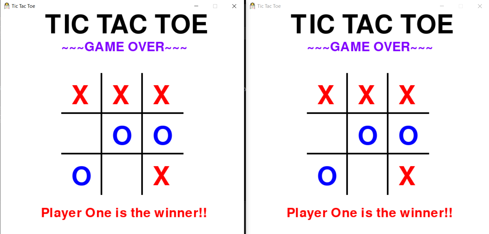
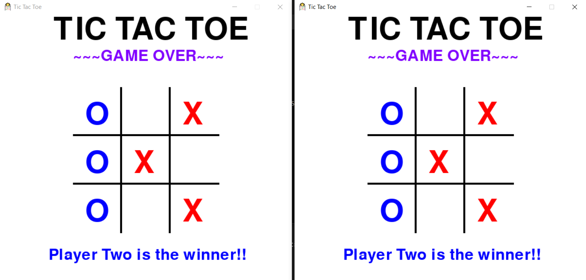
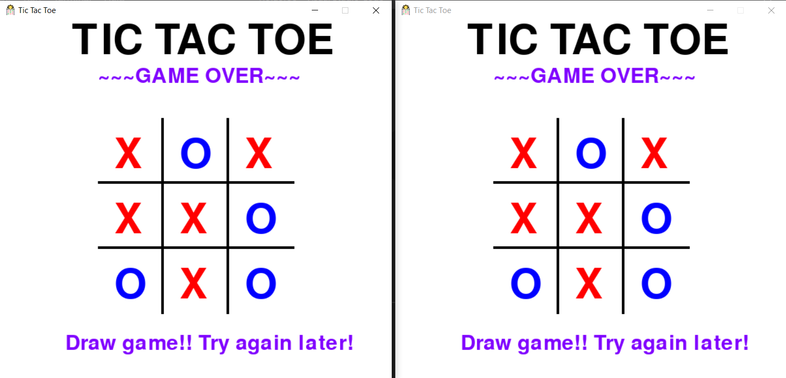

# Tic-Tac-Toe

- Tic Tac Toe game with socket programming and pygame.
- Players can compete against each other over a network by connecting to the server.

## Installing Packages

- Install the following package dependencies using pip:

```bash
pip install pygame
```

---

## How to Play?

- Clone the Repository

<<<<<<< HEAD
```bash
=======
```
>>>>>>> f07e924 (added todos in readmes)
git clone https://github.com/vladi2703/Tic-Tac-Toe.git
```

- On linux machine:

```bash
xhost +local:docker
docker compose up -d
```
<<<<<<< HEAD

- To stop:

```bash
docker compose down
```
=======
python server.py
```

- Start two players and enter the IP address. If both the players are on same host, use the loopback IP `127.0.0.1` or `localhost`.
  - Player 1

    ```
    python player.py
    pygame 1.9.6
    Hello from the pygame community. https://www.pygame.org/contribute.html
    Enter the server IP:localhost
    Connected to : localhost : 9999
    ```

  - Player 2

    ```
    python player.py
    pygame 1.9.6
    Hello from the pygame community. https://www.pygame.org/contribute.html
    Enter the server IP:127.0.0.1
    Connected to : 127.0.0.1 : 9999
    ```

- Now you can start playing Tic Tac Toe over a network.
>>>>>>> f07e924 (added todos in readmes)

---

## Screenshots

|            Player 1             |            Player 2             |
| :-----------------------------: | :-----------------------------: |
|  |  |

### Player 1 Wins



### Player 2 Wins



### Draw Game



---
